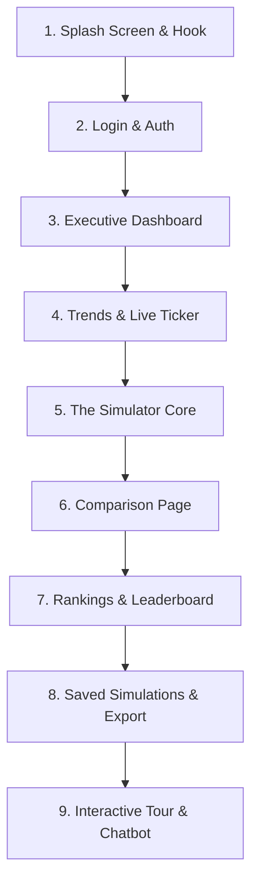

# Influence Simulator: Live Demonstration Script & Navigation Guide

This document is designed to guide you through a professional, high-impact demonstration of the **Influence Simulator** platform for an industry expert. It covers the precise navigation order, interactive step-by-step actions, and the corresponding talking points (both technical and non-technical) for each section.

---

## 1. Demo Checklist (Pre-Presentation)
Before starting, ensure that:
* The React frontend is running locally (usually on [http://localhost:5173](http://localhost:5173)).
* The FastAPI backend is running locally (usually on [http://localhost:8000](http://localhost:8000)).
* The database (PostgreSQL/MongoDB) is connected.
* Your internet connection is active (needed for the "Live Social Data" Wikipedia search API feature).
* You have open the default demo credentials ready:
  * **Email**: `demo@influence.ai`
  * **Password**: `password123`

---

## 2. Navigation Flow & Demonstration Order

---

## 3. Step-by-Step Script

### Step 1: The Splash Screen & Project Hook
* **Action**: Open [http://localhost:5173](http://localhost:5173) in your browser.
* **Visuals**: You will see a dark, premium splash screen with smooth fade-in typography. Let it run for a couple of seconds before clicking the entry button.
* **What to Say (Non-Technical)**:
  > *"Welcome. Today I'm demonstrating the **Influence Simulator**, an enterprise-grade cultural forecasting platform. In a world of short attention spans and rapid trend cycles, businesses spend millions trying to catch the next big wave. Our platform doesn't just track what is popular today—it simulates how ideas, movements, and philosophies evolve and revive over time using predictive algorithms."*
* **What to Say (Technical)**:
  > *"Under the hood, this React application interfaces with a FastAPI backend. We use a hybrid predictive engine combining a machine learning classifier with dynamic Markov Chain state probability matrices, mapping the lifecycle of cultural trends."*

---

### Step 2: Login and Authentication
* **Action**: Let the splash screen redirect you to the Login page. Type `demo@influence.ai` and `password123`, then click **Sign In**.
* **Visuals**: Modern, input forms with interactive focus animations, error validation states, and a smooth redirect to the Dashboard.
* **What to Say (Non-Technical)**:
  > *"We've implemented a robust authentication system using JSON Web Tokens (JWT) and persistent user sessions. This keeps custom forecasts, organizational models, and proprietary simulations completely secure."*

---

### Step 3: The Executive Dashboard
* **Action**: Once logged in, navigate the **Dashboard**. Point to the KPI Cards at the top (Total Simulations, Average Revival Probability, etc.) and the primary trend charts.
* **Visuals**: Clean grid layout, responsive sidebar navigation, vibrant HSL gradients, and interactive tooltips on hover.
* **What to Say (Non-Technical)**:
  > *"This is the central cockpit for an analyst. At a glance, we get macro-level insights: how many total trends we are tracking, average probabilities of cultural revival, and key metrics. This acts as the command center before drilling down into specific predictions."*
* **What to Say (Technical)**:
  > *"The dashboard aggregates metadata using MongoDB aggregation pipelines on the backend. The charts are built using `Chart.js` with responsive configurations, showing live data fetched directly from our API endpoints."*

---

### Step 4: Real-Time Trends & Live Ticker
* **Action**: Click on **Trends** in the sidebar. Scroll through the page, showing the live scrolling ticker at the top and the regional trend cards below.
* **Visuals**: A horizontal scrolling marquee showing trend names and percentage changes, sparkline micro-charts, and regional flags representing North America, Europe, Asia, and Global markets.
* **What to Say (Non-Technical)**:
  > *"Cultural shifts are not uniform across the globe. The Trends page allows users to view live indicators and regional breakdowns. For example, an idea might be declining in North America but undergoing a massive growth phase in Europe. The live ticker provides instant visibility into high-momentum movements."*
* **What to Say (Technical)**:
  > *"We represent regional datasets using a round-robin database grouping. The live ticker is powered by a React hook that manages state updates, generating real-time micro-sparkline visualizations dynamically."*

---

### Step 5: The Simulator (The "Hero" Feature)
* **Action**:
  1. Click **Simulator** in the sidebar.
  2. Search for a pre-loaded concept like **"Stoicism"** in the auto-complete search bar.
  3. Explain the **Scenario Sliders** on the left (Mental Health Index, Economic Instability, Productivity Culture, Social Fragmentation). Move one slider significantly (e.g., set Economic Instability to 90% and Productivity to 20%).
  4. Toggle the **"Live Social Data"** switch on.
  5. Click **Run Simulation**.
* **Visuals**:
  * The main charts reload with sleek skeleton loaders.
  * A detailed line chart showing the **12-Step Lifecycle Projection** (Birth, Growth, Peak, Decline, Dormancy, Revival).
  * A **Markov transition heatmap/matrix** indicating state change probabilities.
  * An **AI Insights Panel** populated with generated text describing the trend's historical context, current state, and peak year projection.
* **What to Say (Non-Technical)**:
  > *"This is the core engine of our platform. We can test any cultural concept under theoretical social conditions. Here, we've loaded 'Stoicism.' By using these sliders, we can simulate an era of extreme economic instability paired with low productivity culture. When we run the simulation, the platform predicts a high revival probability. Why? Because Stoicism historically thrives as a mental resilience framework during times of social and economic crisis.*
  >
  > *Furthermore, by toggling 'Live Social Data,' the engine queries live internet mentions in real-time, infusing live social sentiment and momentum into the historical simulation."*
* **What to Say (Technical)**:
  > *Let's look at the science behind this:*
  > 1. * **ML Classifier**: We use a trained Scikit-Learn Random Forest model that takes 9 feature signals (trend score, momentum, rolling averages, engagement rate, sentiment, etc.) and outputs a base revival probability.
  > 2. * **The Karma Engine**: The base probability is then passed to our Karma Engine. This is a weighted algorithm that measures 'Era Sensitivity.' For instance, Stoicism has high sensitivity weights for mental health crisis (0.85) and economic instability (0.75). The final output is an adjusted probability.
  > 3. * **Markov Chain Transitions**: To model the journey across time, we run a 12-step Markov chain simulation. The 6x6 transition matrix dynamically adapts its transition coefficients depending on the calculated Karma Score and momentum, displaying the state probabilities step-by-step.
  > 4. * **Wikipedia Live Integration**: The Live Social Data feature runs an asynchronous Wikipedia API query. It parses the total search hits and extracts sentiment weights from snippets, feeding them directly into our feature scaling pipeline.
  > 5. * **LLM Metadata Enrichment**: For unknown or newly created ideas, the backend triggers a metadata generation service (powered by LLM) to instantly seed description, origin year, historical relevance, and context directly into MongoDB, providing immediate insights for any query.*

---

### Step 6: Multi-Idea Comparison
* **Action**: Click **Comparison** in the sidebar. Select up to 4 ideas from the dropdown menu (e.g., Stoicism, Minimalism, Nihilism) and compare them.
* **Visuals**: A multi-bar chart comparing revival probabilities side-by-side, accompanied by a comparison card grid outlining the difference in peak years and confidence metrics.
* **What to Say (Non-Technical)**:
  > *"For strategists and brand planners, choosing one avenue of investment is risky. The comparison module lets us plot different concepts side-by-side. We can see which philosophy or trend will peak first, allowing decision-makers to phase their campaigns or products to align with sequential cultural waves."*
* **What to Say (Technical)**:
  > *"This view handles multiple concurrent API requests and maps them to a unified chart dataset, aligning different Markov timelines onto a single visual comparison matrix."*

---

### Step 7: Rankings & Leaderboard
* **Action**: Click on **Rankings** in the sidebar. Show the leaderboard table, sorting by revival probability.
* **Visuals**: A beautifully designed ranking table with badge alerts (e.g., "Rising", "Stable", "Declining") and search filters.
* **What to Say (Non-Technical)**:
  > *"The rankings page acts as a cultural leaderboard, sorting all simulated trends by their likelihood of revival. This helps analysts quickly identify rising stars and declining movements across the entire database."*
* **What to Say (Technical)**:
  > *"To ensure optimal performance, the rankings are sorted on the backend. We have implemented priority-queue heap logic to rank ideas efficiently, ensuring that even with thousands of registered trends, finding the top results takes logarithmic time complexity."*

---

### Step 8: Saved Simulations & Exporting
* **Action**: Click **Saved Simulations** in the sidebar. Click on the **Export** button on one of the saved entries to show the options (Export to PDF, Export to CSV).
* **Visuals**: A clean dashboard showing cards of previously run simulations, including details of the sliders used during that simulation.
* **What to Say (Non-Technical)**:
  > *"No analysis is useful if it remains locked in the app. The Saved Simulations page lets analysts bookmark crucial forecasts, review the parameters used to generate them, and export them directly to PDF reports or CSV datasets for external client presentations."*
* **What to Say (Technical)**:
  > *"We utilize frontend PDF generation libraries (`jspdf` and `html2canvas`) to construct visual documents client-side. This keeps server load minimal while providing instant, high-quality document exports."*

---

### Step 9: The Interactive Analyst Chatbot
* **Action**: Click the floating bubble in the bottom right corner to open the **Influence Analyst**. Ask a question like: *"How does Stoicism respond to high economic instability?"* and hit Send.
* **Visuals**: An elegant glassmorphism sliding chat drawer with a typing indicator, showing responses from the AI.
* **What to Say (Non-Technical)**:
  > *"Finally, we've integrated a conversational AI assistant. Instead of hunting through charts, stakeholders can talk directly to our virtual analyst, asking questions about the math, the models, or the trends, making quantitative forecasting accessible to non-technical users."*
* **What to Say (Technical)**:
  > *"The chat drawer connects to an LLM agent endpoint in the FastAPI backend, utilizing context-aware prompt templates to format answers based on simulated results."*

---

## 4. Q&A Cheat Sheet (How to handle expert questions)

### Q1: "Where does the training data come from, and how is the model evaluated?"
* **Answer**: *"We generated a robust historical dataset mapping trend scores, momentum, rolling averages, and engagement rates over time. The model is trained on a binary classification task (predicting whether an idea will undergo a major revival within the next 3 years). The scikit-learn classifier model is evaluated using F1-score and ROC-AUC curves (details are generated in our local model reports) to ensure high predictive precision before deployment."*

### Q2: "Why use a combination of Markov Chains and Machine Learning instead of just deep learning?"
* **Answer**: *"Deep learning models excel at raw pattern recognition but act as 'black boxes'—they cannot explain *why* a state transitioned. By feeding the output of our Machine Learning classifier into a Markov Chain, we gain the best of both worlds: ML handles complex, non-linear feature signals to predict the base likelihood, while the Markov Chain provides a highly transparent, step-by-step state transition model that we can tweak and verify mathematically. This makes our forecasts auditable and justifiable to business stakeholders."*

### Q3: "How does the system handle cold-starts (new ideas not present in the training set)?"
* **Answer**: *"If a user inputs a completely new idea, our backend runs a profile-similarity fallback algorithm. It uses cosine similarity to compare the new idea's sensitivity parameters with known idea profiles in our database. It then applies a deterministic hashing jitter to the closest match's feature vector. This allows the system to make realistic, logical predictions for brand-new terms without throwing errors or returning blank data."*
